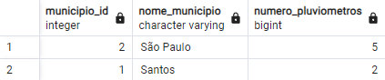
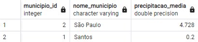
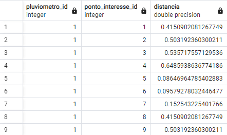
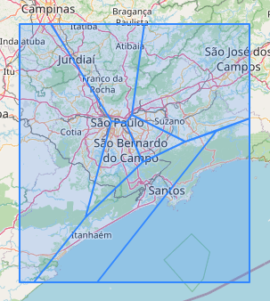
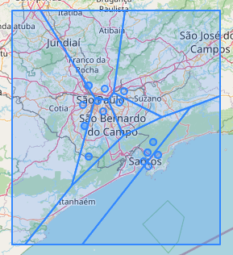
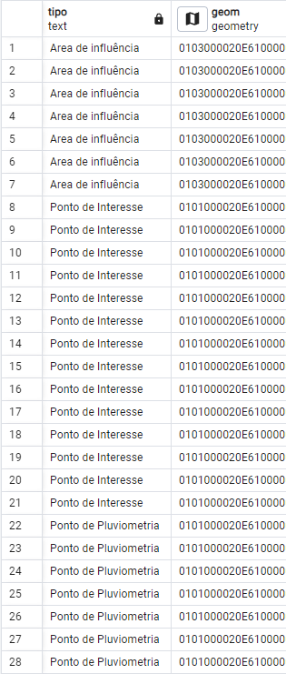

# Introdução

Este repositório foi criado com o objetivo de documentar as respostas e soluções desenvolvidas durante um processo seletivo para a oportunidade de Desenvolvedor Fullstack de uma empresa que atua com a gestão de dados geoespaciais. Aqui apresento minhas abordagens técnicas para resolver problemas relacionados ao processamento de dados georreferenciados.

Gostaria de agradecer a empresa pela oportunidade de participar de seu processo seletivo e ainda conhecer um pouco sobre os desafios diários e as tecnologias utilizadas para resolver problemas complexos de forma eficiente.

# Questões

## Conceituais

1. Nós trabalhamos com séries temporais de pontos, muitas vezes precisando filtrar e realizar requisições de dezenas ou centenas de milhares de pontos georreferenciados (séries temporais, por exemplo, de temperatura, precipitação, umidade, etc.). Como você poderia estruturar o banco de dados para facilitar a busca deste tipo de informação? Quais tipos de índices e chaves implementaria? Como poderia implementar um sistema de tags para permitir diferenciar os tipos de informação?

2. Muitas vezes, precisamos exibir dados de estatísticas temporais e espaciais relacionados a diferentes regiões de interesse, utilizando funções para queries geoespaciais da extensão PostGIS. Dados como: número de novas identificações georreferenciadas em uma área específica, ao longo do tempo; valor médio de um parâmetro em uma área específica nas últimas 24h (exemplo: precipitação média em um município); índices de crescimento ou decrescimento de um parâmetro em um polígono de interesse. Estas consultas são normalmente demasiado demoradas para serem realizadas em tempo real. Como podemos otimizar sua execução e pré-filtrar estes dados para exibição em um dashboard? Como podemos otimizar sua consulta no frontend para garantir uma boa experiência do usuário?

3. Diferentes tipos de usuário possuem diferentes camadas (tipos) de dados (polígonos, pontos, linhas, etc.) e filtros que podem ser aplicados. Estes filtros podem variar desde uma simples consulta por valor específico (por exemplo, ‘regiões ou pontos com precipitação acima de X mm/24hr’) ou consultas geoespaciais mais complexas (por exemplo, ‘pontos que não possuem cobertura de nenhum pluviômetro dentro de um raio de 10 km’). Além disso, cada camada envolve o uso de componentes e funções distintas no frontend de acordo com o tipo de dado carregado (popups, modais de customização e definição de camadas específicas utilizando DeckGL). Como podemos otimizar a organização do código para puxar dinamicamente estes componentes e filtros, visando manutenibilidade e flexibilidade a longo prazo?

4. Alguns dados, devido ao seu volume, devem ser requeridos na forma de um stream (utilizando tecnologia MVT - Mapbox Vector Tiles - para dados vetoriais, ou WMS/Tile Layers para dados de imagens). Outros podem ser carregados integralmente no frontend para comporem as diferentes camadas de exibição no mapa dinâmico. Como podemos implementar um sistema de caching que agilize a experiência do usuário durante sua sessão de uso?

5. Diversos componentes distintos dentro do frontend do sistema requerem o mesmo tipo de dado compartilhado (por exemplo, informações sobre o usuário ou uma estatística sobre os dados carregados no sistema de acordo com os filtros selecionados). Qual a melhor forma de compartilhar esta informação para minimizar o número de requisições que devem ser realizadas ao banco, e simplificar o fluxo lógico do código (isto é, evitar longas cadeias de dependência entre componentes)?

## Práticas

Dados georreferenciados podem ser armazenados em diferentes tipos de arquivos (.shp, .geojson, .kml, por exemplo), e por sua vez podem ser incorporados em um banco de dados capaz de armazenar e tratar dados geoespaciais (por exemplo, utilizando a extens˜ao PostGIS para PostgreSQL).

Em anexo a estas questões, dois arquivos foram fornecidos:

- municipios.geojson, contendo polígonos que demarcam dois municípios
- pluviometros.geojson, contendo pontos de estações pluviométricas nestes municípios, cuja tabela de atributos possui 4 valores, sendo estes
a precipitação acumulada em 24h, 48h, 72h, e 96h.
- pontos interesse.geojson, contendo pontos de interesse.

Desenvolva um código que possa calcular e visualizar:
1. O número de pluviômetros em cada município.
2. A precipitação média em 96h para cada município.
3. A distância entre os pluviômetros e cada um dos pontos de interesse.
4. Os ’Polígonos de Voronoi’ a partir dos pontos de pluviometria. Estes
são polígonos que delimitam a área de influência de cada pluviômetro
e ajudam a decidir qual dado deverá ser utilizado para calcular a precipitação em um ponto específico. Uma referência para a construção destes poligonos está na documentação da função no PostGIS (https://postgis.net/docs/ST_VoronoiPolygons.html). Ela retorna uma GeometryCollection, que pode ser convertida em
um MultiPolygon utilizando a função ST CollectionExtract (https:
//postgis.net/docs/ST_CollectionExtract.html). Finalmente,
um MultiPolygon pode ser convertido para uma série de polígonos
usando ST Dump (https://postgis.net/docs/ST_Dump.html).
Utilizando este método, em qual ’polígono de influência’ cada um
dos pontos de interesse cai?

# Respostas

## Conceituais

### Questão 1

O fundamental neste caso é a utilização de um banco de dados com suporte apropriado para tipos de dados geoespaciais. O banco de dados relacional PostgreSQL conta com a extensão PostGIS que oferece recursos como armazenamento de dados espaciais como pontos, linhas, polígonos e multigeometrias em 2D e 3D, indexação espacial para buscas ágeis, funções espaciais que permitem analisar e filtrar dados geográficos e ainda oferecendo integrações com aplicações como QGIS e Tableau.

A fim de otimizar consultas e reduzir cargas é possível escolher estratégias como o uso de tabelas separadas, mas relacionadas, para armazenamento de metadados e outra para informações contextuais, por exemplo, em uma tabela teríamos informações como timestamp, temperatura, precipitação e humidade e em outra teríamos o armazenamento de informações geoespaciais.

O postGis oferece uma opção eficiente para índices geoespaciais como o GIST (Generalized Search Tree), que é ideal para buscas espaciais, e ainda é possível aplicar índices em colunas temporais para acelerar consultas baseadas no tempo.

Um sistema de tags pode agilizar a busca por dados relevantes e ajudar a organizá-los, principalmente quando tratamos de informações com várias dimensões como temperatura, precipitação, umidade e afins. As tags podem ser implementadas em formato de array, onde uma única coluna poderia ter nenhuma ou várias tags para classificar seus registros. Retornando ao exemplo de fracionar as informações entre tabelas, existe a possibilidade de criar uma tabela para as tags e uma tabela relacionando os registros contextualizados às tags, como em um relacionamento muitos para muitos.

### Questão 2

Para auxiliar na otimização de consultas que não precisam necessariamente ser executadas em tempo real, é válido pensar em utilizar as [Materialized Views](https://www.postgresql.org/docs/current/rules-materializedviews.html) do PostgreSQL que utilizam de tabelas a parte para salvar informações sobre uma view em específico e podem ser atualizadas de acordo tempos em tempos de acordo com a necessidade e a disponibilidade de recursos.

Ainda existe a possibilidade de utilizar a [Partição de Tabelas](https://www.postgresql.org/docs/current/ddl-partitioning.html) que divide uma tabela em vários segmentos, dando a possibilidade de executar consultas em determinada partição da tabela, que acontece de modo a ignorar as outras partições, e dessa maneira realizando filtros muito mais eficientes.

Aliado ao banco relacional, a estratégia de adotar um banco de dados não relacional é super atraente pois apresenta maior agilidade na entrega do resultado. Armazenando o resultado de consultas recorrentes e/ou que necessitam de uma resposta mais rápida são oportunidades para bancos como o [Redis](https://redis.io/).

A experiência do usuário pode ser beneficiada pelos argumentos acima que atuam do lado do backend, mas ainda existem recursos que podem ser aplicados no frontend, como paginações que aliviam a sobrecarga de informações e podem indicar a continuação das informações. Lazy loadings servem ao propósito de carregar quantias de dados relativamente menores conforme o usuário vai utilizando a página, evitando uma demora maior por um volume maior de informações. Para apresentação de gráficos, mapas ou interatividades existe a possibilidade de reduzir o conjunto de informações com funções de agregação, de modo que se possa demonstrar a informação correta e necessária, mas de modo sucinto e eficiente.

### Questão 3

A componentização modular pode vir a ser útil em um contexto em que a flexibilidade e manutenibilidade  a longo prazo são prioridades. Condizendo com o padrão da Responsabilidade Única do SOLID, a criação de componentes especializados que podem vir a se repetir no código, garantem a usabilidade em vários lugares e a manutenção em apenas um. Por exemplo, podemos criar componente para renderizar um elemento específico para polígonos, outro para linhas e outro para pontos, não se limitando a associá-los com componentes capazes de realizar filtros.

A componentização ainda permite uma arquitetura de componentes baseados em esquemas, onde cada parte do sistema pode apresentar um arquivo de esquema contendo diferentes componentes que o compõem.

Vale ressaltar a necessidade de uma documentação muito bem construída, uma vez que os componentes precisarão se comunicar com o restante da aplicação para construir o sistema.

### Questão 4

No backend é possível configurar o cache no web server (como no nginx, por exemplo), ou com um banco de dados não relacional atuando em conjunto, assim é possível evitar o reprocessamento de funções e queries mais complexas, ou ainda servir os arquivos que são requisitados mais frequentemente.

Caching em Web Storage é uma solução para reutilização dos dados armazenados diretamente no navegador, muito útil em sessões de uso prolongado, principalmente se os usuários interagem repetidamente com as mesmas regiões do mapa. A estratégia reutiliza os dados que estão em cache em vez de requisitar os mesmos dados para o servidor. Podendo priorizar por arquivos mais importantes ou mais utilizados caso o cliente tenha alguma limitação de armazenamento.

Ao trabalhar com dados dinâmicos é importante estar atento a invalidação dos dados em cache. Pelo lado do servidor é possível realizar a invalidação por meio de eventos, pelo lado do cliente é possível a utilização de [Service Workers](https://developer.mozilla.org/en-US/docs/Web/API/Service_Worker_API) para sincronizar as informações sem que seja necessária uma ação do usuário. Em ambos os casos é possível ainda, a utilização de invalidação temporal de cache, onde os arquivos em cache possuem um tempo de vida antes de serem excluídos ou renovados.

### Questão 5

Uma das soluções para gerenciamento de estado de aplicação, no caso do VueJS, é o [Vuex](https://vuex.vuejs.org/) que permite que qualquer componente da aplicação acesse dados armazenados, centralizando informações como os dados de preferências do usuário. Essa estratégia garante que determinadas informações estarão sempre à mão, sem que seja necessária uma requisição ao backend por exemplo, ou que fiquem expostos no local storage.

O local storage por sua vez é uma alternativa interessante por possibilitar manter os dados armazenados entre sessões dos usuários, podendo recuperá-los em visitas subsequentes, e só os requisitar no backend quando eles não estiverem presentes.

## Práticas

### Criação e população das tabelas:

A fim de criar um banco de dados e um ambiente para administração, foi criado uma estrutura em docker, utilizando a imagem do [PostGIS](https://hub.docker.com/r/postgis/postgis) sendo o banco de dados PostgreSQL já com a extensão PostGIS para manipulação de dados geoespaciais, e a imagem do SGBD [PgAdmin](https://hub.docker.com/r/elestio/pgadmin), que foi o ambiente utilizado para realização das consultas mostradas a seguir.

As tabelas foram criadas de acordo com o nome do arquivo, sendo elas *municipio*, *pluviometros* e *pontos_interesse*. O script para geração das tabelas é encontrado no arquivo ./database/create-tables.sql.

As tabelas foram populadas através do software QGIS, sendo que este foi instalado na máquina, realizado a conexão e importado os arquivos para o banco de dados.

### Questão 1
Para encontrar o número de pluviômetros em cada município é necessário realizar uma junção (join) entre as tabelas *municipio* e *pluviometros*. As colunas de ligação para a cláusula **ON** são o ponto de localização de cada pluviômetro e a área de cada município.

Segundo o capítulo [11. Spatial Relationships](https://postgis.net/workshops/postgis-intro/spatial_relationships.html) da documentação do PostGIS, é possível utilizar funções como a **ST_Intersects** para verificar a interseção entre ponto e polígono, ou seja, se o ponto está contido dentro da área do polígono a função retorna um valor verdadeiro. E no capítulo [13. Spatial Joins](https://postgis.net/workshops/postgis-intro/joins.html) é demonstrado a possibilidade de realizar a junção entre as duas tabelas através dessas funções. O script SQL que dará a resposta correta é o seguinte:

```SQL
SELECT 
    m.id AS municipio_id,
    m.nm_mun AS nome_municipio,
    COUNT(p.id) AS numero_pluviometros
FROM 
    public.municipios AS m
LEFT JOIN 
    public.pluviometros AS p ON ST_Intersects(m.geom, p.geom)
GROUP BY 
    m.id
ORDER BY 
    numero_pluviometros DESC;
```

Os registros resultantes da consulta são mostrados na imagem abaixo:



### Questão 2
A precipitação média é obtida utilizando a função **AVG** (abreviação de average, em tradução direta média) a partir da mesma lógica que utilizamos na questão anterior para realizar a junção das tabelas, ficando da seguinte maneira:

```SQL
SELECT 
    m.id AS municipio_id,
    m.nm_mun AS nome_municipio,
    AVG(p.acc96hr) AS precipitacao_media
FROM 
    public.municipios AS m
LEFT JOIN 
    public.pluviometros AS p ON ST_Intersects(m.geom, p.geom)
GROUP BY 
    m.id
ORDER BY 
    precipitacao_media DESC;
```

Os registros resultantes da consulta são mostrados na imagem abaixo:



### Questão 3
A distância entre cada pluviômetros e cada ponto de interesse possui uma relação diferente, onde será utilizado a junção **CROSS JOIN** para associar cada registro da tabela *pluviometros* com cada um dos registros da tabela *pontos_interesse*,sem a necessidade de uma coluna de ligação entre elas.

Ainda no capítulo [11. Spatial Relationships](https://postgis.net/workshops/postgis-intro/spatial_relationships.html) temos a função **ST_Distance** que retorna um valor numérico representando a distância entre duas geometrias.

```SQL
SELECT
    p.id AS pluviometro_id,
	i.id AS ponto_interesse_id,
	ST_Distance(p.geom, i.geom) AS distancia
FROM
	pluviometros AS p
CROSS JOIN
	pontos_interesse AS i
ORDER BY
	p.id, i.id;
```

Os registros resultantes da consulta são parcialmente mostrados (pois foram 98 registros retornados) na imagem abaixo:



### Questão 4
O diagrama de Voronoi é uma decomposição do espaço de acordo com as distâncias entre um conjunto de pontos distribuídos, onde cada porção ou área é chamada de célula de Voronoi. Para cada célula de Voronoi é garantido que qualquer ponto em seu interior terá a menor distância até o ponto distribuído do que qualquer outro ponto distribuído das outras células. A técnica é utilizada em design de jogos para gerações procedurais, em computação gráfica para criação de padrões, geografia e urbanismo para dividir áreas de influência entre outros exemplos.

Segundo a documentação da função [ST_VoronoiPolygons](https://postgis.net/docs/ST_VoronoiPolygons.html) é recebido como primeiro parâmetro uma coleção de vértices, que nesse caso são os pontos de pluviometria. Para reunir os dados de maneira a satisfazer a função de Voronoi, utilizamos a função [ST_Collect](https://postgis.net/docs/ST_Collect.html) para criar a coleção de pontos. Em seguida aplicamos a função de Voronoi que retorna uma coleção de geometrias e em seguida a função [ST_CollectionExtract](https://postgis.net/docs/ST_CollectionExtract.html) para retornar um multi-geometry.

Até aqui temos a seguinte consulta para obter os polígonos de Voronoi:
```SQL
SELECT
	ST_CollectionExtract(ST_VoronoiPolygons(ST_Collect(p.geom))) as geom
FROM public.pluviometros AS p;
```
Já é possível ter a visualização dos polígonos na imagem abaixo:



Ainda é necessário separar o resultado multi-geometry em polígonos separados utilizando a função [ST_Dump](https://postgis.net/docs/ST_Dump.html) e selecionar apenas as geometrias dele.

Agora para selecionar os polígonos de Voronoi, os pontos de interesse e os pontos de pluviometria, será utilizado o **UNION ALL** para obtermos todos esses resultados em um mesmo conjunto. Concluindo o código, ainda foi adicionado uma coluna para nomear o registro de acordo com sua representação:

```SQL
SELECT
	'Area de influência' AS tipo,
	(ST_Dump(
		ST_CollectionExtract(
			ST_VoronoiPolygons(
				ST_Collect(p.geom)
			)
		)
	)).geom as geom
FROM public.pluviometros AS p
UNION ALL
SELECT
	'Ponto de Interesse' AS tipo,
	p.geom AS geom
FROM
	public.pontos_interesse as p
UNION ALL
SELECT
	'Ponto de Pluviometria' AS tipo,
    ip.geom AS geom
FROM 
    public.pluviometros AS ip;
```

A seguir a visualização dos polígonos de Voronoi, pontos de interesse e pontos de pluviometria resultantes da consulta.



A seguir os registros dos polígonos de Voronoi, pontos de interesse e pontos de pluviometria resultantes da consulta.

